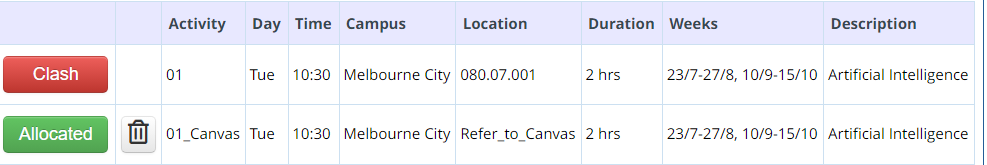

# General FAQ for RMIT AI COSC1125/1127

As any FAQ page, this page is always "under construction”. As we realize that some questions become common, we add them here…

For specific FAQ on PACMAN see [here](../AI23-DOC.git/FAQ-PACMAN.md).

- [General FAQ for RMIT AI COSC1125/1127](#general-faq-for-rmit-ai-cosc11251127)
- [GENERAL](#general)
  - [Why this FAQ?](#why-this-faq)
  - [Communication policy: I have a question, can I email you?](#communication-policy-i-have-a-question-can-i-email-you)
  - [I work outside and have other commitments, should I take this course?](#i-work-outside-and-have-other-commitments-should-i-take-this-course)
  - [I want to discuss something face-to-face, can I?](#i-want-to-discuss-something-face-to-face-can-i)
  - [Attendance: do I need to attend lectorials and tutorials?](#attendance-do-i-need-to-attend-lectorials-and-tutorials)
  - [Is there any mentoring program for this course?](#is-there-any-mentoring-program-for-this-course)
  - [Can I audit the course?](#can-i-audit-the-course)
  - [Course Survey Experience: what? why?](#course-survey-experience-what-why)
  - [I am enrolled in COSC1125 (PGRD) but my Canvas says COSC1127 (UGRD). Is everything OK?](#i-am-enrolled-in-cosc1125-pgrd-but-my-canvas-says-cosc1127-ugrd-is-everything-ok)
  - [I enrolled late in the course, can you explain me about X, Y, and Z about the course? What should I do now?](#i-enrolled-late-in-the-course-can-you-explain-me-about-x-y-and-z-about-the-course-what-should-i-do-now)
  - [I have a question about the course, but it is not here!](#i-have-a-question-about-the-course-but-it-is-not-here)
  - [Why do you use many platforms (EdStem, Canvas, GitHub, email, GH Classroom, Google, etc.) instead of just Canvas as other courses?](#why-do-you-use-many-platforms-edstem-canvas-github-email-gh-classroom-google-etc-instead-of-just-canvas-as-other-courses)
- [DISCUSSION FORUM \& FORUM ETIQUETTE](#discussion-forum--forum-etiquette)
- [LECTORIALS \& TUTORIALS](#lectorials--tutorials)
  - [I have a timetable clash. There are no space available. Classes full. What should I do?](#i-have-a-timetable-clash-there-are-no-space-available-classes-full-what-should-i-do)
  - [Do we have lectures? What is a lectorial?](#do-we-have-lectures-what-is-a-lectorial)
  - [Can I attend in-person lectorials/tutorials remotely?](#can-i-attend-in-person-lectorialstutorials-remotely)
  - [When are lecture slides made available?](#when-are-lecture-slides-made-available)
  - [What is the `01_Canvas` session?](#what-is-the-01_canvas-session)
  - [Will there be lectorial recordings?](#will-there-be-lectorial-recordings)
  - [When are we getting the tute solutions and why are we not getting them all quickly?](#when-are-we-getting-the-tute-solutions-and-why-are-we-not-getting-them-all-quickly)
  - [What about tutes, labs, consultation times? Will they be recorded?](#what-about-tutes-labs-consultation-times-will-they-be-recorded)
  - [Why don't we get the concrete final answer to questions instead of getting a rephrase of questions or a question back?](#why-dont-we-get-the-concrete-final-answer-to-questions-instead-of-getting-a-rephrase-of-questions-or-a-question-back)
  - [I cannot enroll in any tutorial, they are all full. What should I do?](#i-cannot-enroll-in-any-tutorial-they-are-all-full-what-should-i-do)
  - [I cannot attend my tutorial session, can I change to another session?](#i-cannot-attend-my-tutorial-session-can-i-change-to-another-session)
- [ASSESSMENTS](#assessments)
  - [Are there team assessments or projects?](#are-there-team-assessments-or-projects)
  - [I have not received the result of my assessment, why?](#i-have-not-received-the-result-of-my-assessment-why)
  - [I was never asked these questions in an assignment or test, why?](#i-was-never-asked-these-questions-in-an-assignment-or-test-why)
  - [I enrolled late into the course, can I get an extension?](#i-enrolled-late-into-the-course-can-i-get-an-extension)
  - [Can I ask questions on an assignment/assessment in the forum?](#can-i-ask-questions-on-an-assignmentassessment-in-the-forum)
  - [I am very busy with other commitments (work, other subjects, travel, etc.) and may not be able to make the deadline, can I get a 2-3 day extension?](#i-am-very-busy-with-other-commitments-work-other-subjects-travel-etc-and-may-not-be-able-to-make-the-deadline-can-i-get-a-2-3-day-extension)
  - [Can I submit late? What is the penalty?](#can-i-submit-late-what-is-the-penalty)
  - [What is the policy on Special Consideration (SPC)?](#what-is-the-policy-on-special-consideration-spc)
  - [I am not available for the Exercise Challenge (EC) or Take Home Exercises (THE), can I take them some other time?](#i-am-not-available-for-the-exercise-challenge-ec-or-take-home-exercises-the-can-i-take-them-some-other-time)
  - [I have a SPC for the THE/EC, how does it work?](#i-have-a-spc-for-the-theec-how-does-it-work)
  - [The room for the time-based and timetabled assessment is not comfortable; can we get a larger room?](#the-room-for-the-time-based-and-timetabled-assessment-is-not-comfortable-can-we-get-a-larger-room)
  - [Why is THE/EC are not fully done on paper or done online at home?](#why-is-theec-are-not-fully-done-on-paper-or-done-online-at-home)
  - [In a code assignment/project, how do I make sure I do not go against academic integrity?](#in-a-code-assignmentproject-how-do-i-make-sure-i-do-not-go-against-academic-integrity)
  - [Why did I get 57 in the assignment/project if it is 5% of the course?](#why-did-i-get-57-in-the-assignmentproject-if-it-is-5-of-the-course)
  - [How do I prepare for the final in-person assessment (THE/EC)?](#how-do-i-prepare-for-the-final-in-person-assessment-theec)

# GENERAL

## Why this FAQ?

This question is already answered in the [FAQ](../AI23-DOC.git/FAQ-COURSE.md). ;-)

If, somehow, you managed to get out of the [self-reference](https://en.wikipedia.org/wiki/Self-reference), then this is the list of usual questions that are asked about the course. A FAQ like this can help you find the answer right away. There are also many questions that can shed some light on the rationale of certain policies or approaches to the course. Also, by having an FAQ I am able to provide consistent and uniform answers to everyone. Of course, if you cannot find your question here, then you are invited to post it in the discussion forum. As questions become more common or usual, I add them to this list. So, maybe your new question can make it to the list! :-)

## Communication policy: I have a question, can I email you?

**Communication/email policy:** Except for personal issues, all electronic communication must be directed to the Discussion Forum. I only use e-mail for limited communications regarding **personal circumstances** (in many cases, email is just used to arrange a face-to-face meeting). In particular, I will not respond by e-mail to any requests to clarify lecture, tutorial, or assignment questions. Please use lectures, tutorials, labs, and especially the course forum for all such questions so that a _fair course is run_ and all other fellow students can benefit as well: **_sharing is caring_**.

Do not be afraid to post any question (of course, as long as it is a proper question: just asking for “help” or providing solutions/insights on assignments is not good, as it shows none effort or may amount to plagiarism), no question is stupid! To benefit from others, then, please ensure that you _regularly check_ the course website and attend lectures and tutorials.

## I work outside and have other commitments, should I take this course?

It is very difficult for me to answer this question, every student's circumstances and skills are different.

What I can say is this course is _not_ one you can take “on the side” and does indeed require significant commitment. If you will have limited time to devote to course sessions (lectorials and tutorials) or don’t have much flexibility or bandwidth to work with others, think carefully whether you want to take the course, to avoid pitfalls, unnecessary stress, and negative impact to others.  There is significant reading, coding, and math processes. In most cases, all that requires _time_ and _motivation_.

## I want to discuss something face-to-face, can I?

I am happy to talk to you face-to-face and without a keyboard in the middle! That is particularly important when the matter is personal and “difficult”. Please send me an email and we will arrange an appointment to discuss something particular and we’ll try to work it out.

However, if what you are after is technical support with the course, then you should use the plenty of support already available in tutorials and drop-in lab sessions, that is exactly where we have tutors ready to help in a one-to-one fashion. Go and ask your question there, **help us to help you!** Of course, questions can also be asked during (and after!) lectorials or shared in the course forum! So plenty of opportunities to get help. Finally, when you take a course, you want to ENJOY it. Not having enough bandwidth to do it, will frustrate you and others, and make the “AI experience” a not so great one...

## Attendance: do I need to attend lectorials and tutorials?

The short answer is: _No_. Is it probably a very good idea to attend them? _Yes_

While a minimum attendance standard is not compulsory, **non-attendance may seriously jeopardise the chances of success in this course**. First, non-attendance at in-person assessments (e.g., Exercise Challenges or marked class quizzes), will result in failure of that assessment (no replacements). Second, the teacher will generally identify very subtle technical points in the material, discuss them, and give insights that will usually be quite difficult for a student to grasp by themselves "alone" (most probably it will be totally missed). Finally, in the lectorial, the teacher will put the material in context (why? what? when?), which will help ground the technical content and help in understanding and motivation. So, we strongly suggest to attend ALL lectures and ALL tutorials to maximise the chances of success in the course.

There are also other good reasons to attend in-person teaching sessions, besides just "passing" the course. Studying at uni is a _privilege_ that very few of us have, and a unique aspect of it is the possibility to be taught interactively, on the spot, by uni academics, who are also scientists in the field! Also very important is the ability of interacting with other fellow students who are in "the same learning boat": they could be your new friends and/or colleagues! All this makes uni unique and different from watching videos or learning by yourself, so not attending sessions kind of gives up what is probably the main feature of uni study. Also, for many students, this may be the only time in their lives (to be studying at Uni), so it is wise not to miss out, I think :-)

In the last couple of years, during COVID times, we have experienced first-hand how limited the online experience is and how much better, fruitful, and enjoyable is in-person learning. So, I hope this will motivate us all to make that extra effort to "be there". It not only enhance your own experience, but also that of others. So, "being there" is contributing to the learning of everyone.

**IMPORTANT:** Note that, from this semester, RMIT is committed to _in-person teaching on campus_. So, the course will NOT run online or in hybrid mode anymore, as it did in previous years due to COVID. This means that you should _not_ expect that what happens face-to-face (in-person) will have an "online replacement" (be online streaming, recording, replacement sessions, etc.) This does not mean there will be no online presence, sure there will be (e.g., forum, GitHub), but as additional and complementary resources, not as replacements or interchange.

So, hope to see you in the room, interacting with teachers and fellow students!

## Is there any mentoring program for this course?

It is usually difficult to get mentors for this last year course. In 2023, I was informed that:

> As there is no mentor has been recruited for your course Artificial Intelligence COSC1127 this semester, we regret to inform you that we are unable to fulfill your request.

So, by default, assume there is no mentorship program for the course. But I will let you know otherwise... 😉

## Can I audit the course?

**Fine with me!** ... as long it is feasible in the course (e.g., there is a seat in the room!) and you understand that:

1. You will not be assessed on your work, formally or informally. The tutors are there to help the enrolled students. You may not take any assessments, in-person or not. But of course you can do it by youself!
2. You may not be enrolled into the formal systems of RMIT for the course.

In general, auditing means attending the lectorials, which arguably is what you wouldn't be able to get elsewhere, the sublteties, "story", and interactivity with others.

## Course Survey Experience: what? why?

The **usefulness of student course surveys** has been the subject of **much debate** lately in the academia and whether it is a useful tool to improve the quality of teaching or just a mechanism that leads to _grade inflation_ and _lower teaching standards_. If you want to read more about this debate, see the articles I added below.

Regardless of views, the fact is that the Course Survey is **used to evaluate us, academic staff, in our teaching**. It is in fact the main & only teaching evaluation source! 

Unfortunately, students generally do not know the context of these surveys, how they are used and what are the "standards" used. So here is a bit of information...

The Course Survey gives, in the end, a **mean Good Teaching Score (mGTS)**, ranging from 1 to 5. The average mGTS across RMIT is around 4.12.  The **target mGTS** (that is, what we are expected to achieve to be considered "OK") for our courses is 4.08 (that is 81%+). This means that whenever you give a score that is:

- **1, 2 or 3**: you are judging negative the course and below the bar, that is, the course is on the "poor" side. Scores 1 and 2 would be extremely and very negative, resp, whereas a 3 would be negative score. 😢😢
- **4**: you are judging the course as "just OK", maybe a bit lower than expected but not so much. Not a great course, but also not a disaster. 😢
- **4+**: you are judging the course to be good, and as it approaches 5, very good. 👍

This means that a **score of 3 is _not_ "neutral"**, it is basically a negative judgment: _a poor, though not terrible, course._ Almost no student is aware of this fact, unfortunately.... 😕

Nevertheless, regardless of how student feedback is used by Universities, in my view, **the best use of student feedback is for the students themselves**! What I mean is that it is very useful for prospective students to know what previous fellow students have said about the course in general and the lecturer. This allows students to set their mind in the right way, plan ahead and prepare, and build accurate expectations. Basically, _would you recommend this course to a friend?_ Would you recommend the lecturer? _While the results are generally not given to students, **_I personally show my previous results for my courses_**.

I am very interested in the feedback of those who have participated in the course actively, by attending lectures, tutorials, using the web page, etc. **Your contribution is very meaningful for future students, so help them out! :-)**

**_You say more?_**  As stated above, there has been a _lot_ of (interesting) debate whether these surveys are a good idea, or if in the end, they backfire in terms of education, as academics give in to the temptation of providing easier and easier course to avoid negative feedback, thus causing grade inflation and poor learning outcomes to students. As promised above, some essays on the issue and problems of student course surveys, for those of you who are interested (which I hope are many!).

The article [Student Course Evaluations Get An 'F'](http://tinyurl.com/nxsmyc4) is very interesting and reports on some findings:

_Here's what he found. The better the professors were, as measured by their students' grades in later classes, the lower their ratings from students._

_"If you make your students do well in their academic career, you get worse evaluations from your students," Pellizzari said. Students, by and large, don't enjoy learning from a taskmaster, even if it does them some good._

_There's an intriguing exception to the pattern: Classes full of highly skilled students do give highly skilled teachers high marks. Perhaps the smartest kids do see the benefit of being pushed._

_Measuring the teacher by how well the student did in the next course is an important part of this experiment. Previous papers, says Pellizzari, compared student ratings to student grades within that same course. An easy-A prof may earn five stars in return for handing out good grades. But this leniency, his research suggests, does the students no long-term favors._

Other articles show evidence that there may be _negative_ correlation between student evaluation and learning:

1. [Zero Correlation Between Evaluations and Learning - New study could be another nail in the coffin for the validity of student evaluations of teaching](http://tinyurl.com/hdd7979).
2. [Students don't know what's best for their own learning](https://theconversation.com/students-dont-know-whats-best-for-their-own-learning-33835).

This is a bit worrying because even if the original intentions were well intended, the final outcome is detrimental to _students_ in the long run.

More articles on Course Surveys and Grade Inflation:

- [‘A’ Is for Average: College Grade Inflation](http://tinyurl.com/h2d88cy)
- [The New Normal: The Problem of Grade Inflation in American Schools](https://drive.google.com/file/d/1Z1vjzcpsA3n0m3_A6NtRYwxMid1afT9b/view?usp=sharing)
- [When A is for Average: the High Cost of Grade Inflation](http://tinyurl.com/oc2ewhl) – Tutor Talk.

Finally, if you are interested in education in general, and university and university in Australia, this podcast in ABC Big Ideas is a must:

- [What students really think of the university](http://tinyurl.com/lrdem76) - Big Ideas - ABC Radio National (Australian Broadcasting Corporation).

I think that as a University student and future graduate, you should know about all this, be interested, and form your own informed opinion. _Your journey at uni should be much more than collecting credits and learning predicate logic!_ **_Enjoy it!_**

## I am enrolled in COSC1125 (PGRD) but my Canvas says COSC1127 (UGRD). Is everything OK?

Yes, no need to worry. This is just a Canvas "hack" for cross-listed courses. We maintain only one site (COSC1127's one), but everybody in the course can access it. No problem.

## I enrolled late in the course, can you explain me about X, Y, and Z about the course? What should I do now?

First of all, I assume you have discussed your late enrollment with your Program Manager. This is important. We assume students have been diligent beforehand and are fully ready and enrolled at least in Week 0, if not before.

Enrolling late means that you have lost content and information about the course, and possibly assessments. This is fine as long as you **got the OK of your Program Manager** and you take **full responsibility** of your late entering to the course, _without shifting the burden to the teaching staff_.

Think about it: joining a course in week 2 or 3 is like getting 15' late to a meeting with lots of people: you do it with care, trying not to bother others, and assuming _full responsibility_ for having arrived "late". Would you stop the meeting and ask: _"can you please tell me what you have been discussing so far?"_ Surely not... ;-)

So this means that:

1. The teaching staff will not go over the course logistics and information on a per-student basis when the student has joined the course late (and lost the first week of information and course overview).
   - This means you would have to gather the information provided in the first weeks by yourself, by reading the online course pages/information, parsing all relevant forum posts, watching the videos and recordings. You would probably benefit from talking to other fellow students who are in sync with the course.
   - Please, do not ask the teaching staff to go over the course details _again_, but if you have to, please do it _after_ you have processed everything and do it _in person_ in lectorials, tutorials, consultation time. This would show that you really care and put a legitimate effort to catch-up (and hence the teaching staff will be more sympathetic). :-)
2. You will have to catch-up with the technical content of the course.  This is an intense course and there is significant reading allocated to each week, starting from week 1 itself. This means you would have to put significant effort to sync with the course.
   - Entering in week 2+ should be doable with effort; after that would be very challenging and risk.
3. You are not entitled to any extension or re-do of assessments run or distributed already when you enrolled.

In summary, the course is very intense, even for those starting on time, and every week matters. I am OK if you join late after discussing with your PM, as long as you **take full responsibility** of such late start. Of course I am also OK with students contacting me before formally enrolled and while they are waiting for administrative process to conclude; this will allow students to stay in sync with the course until all paper-work is sorted out.

Hope this is clear and all the best in the course!

## I have a question about the course, but it is not here!

If you have any questions about the course that you think other fellow students may be also interested to learn, please post it in the forum!

## Why do you use many platforms (EdStem, Canvas, GitHub, email, GH Classroom, Google, etc.) instead of just Canvas as other courses?

This is a valid question that some student have, as they see themselves learning a few new platforms for the course.

First, be assured that the use of several platforms and tools is not random: _there is a rationale with significant thought, experience, and work behind_.

In general, for this course we are mostly using EdStem and GitHub alone, that's all, with occasionally 2-4 emails for details on the results (~1 email per project). That does not seem to be an overload for uni-level.

More broadly, I am on the opinion that it is actually _not_ so good for the student learning to prioritize "uniformity" due to (at least) two reasons:

1. First, it is just **impossible and unrealistic in Computer Science**: there are lots of technologies and systems around that are all useful in their own way and that different people use, be Github, Slack, Canvas, Latex, email, Discord, Edstem, Travis, Jira, stack-overflow, Menti, etc.
   * A good CS practicioner should not only be versed on many of them, but also flexible adaptive enough to learn and manage new ones as they are needed or requested (e.g., at work or on an open-source project).
   * As a student itself put it in a feedback: _"I like the fact that our submission is done through GitHub as it provides some industrial sample."_
2. As an educator, I _personally_ **don't believe in a "McDonald"-type uniform approach to education and learning**, under which everything is in the same place, color, format, size, and taste 😆.
   * While uniformity may provide a sense of "safety" to students, it does not train them to be _flexible_ and _adaptive_. It also does not recognise that there are indeed different teachers and different styles of teaching, like in the real world.
   * So, I do think it is beneficial for students to be exposed to different style of teachers and teaching styles, so they can learn many ways, not just "one way". 😃

Now, the above **does _not_ mean that one can use many different things/tools/platform just for the sake of making things non-uniform!** There must be a technical reason behind! The point is that _if_ there is a tool X that solves problem A better, then fine, let's use X and accept that not everything comes in the same way.

Note that **sometimes a student may not _directly_ understand** in which sense an option is "better", but here is where we expect students to trust the expertise and experience of the teacher, as much as one trusts a pilot when boarding a plane!

* For example, a student may not understand why we don't use Canvas discussion forum and the fact that forums like EdStem and Piazza not only increases engagement a lot (between 7x to 10x), but also are much much more productive for the teaching staff, which in turn allows staff to answer way many more questions and quicker, thus providing better service for more students.

Finally, I note that this is **MY approach/view/perspective to Computer Science and Education** at uni level, this part of my "teaching style".  I accept others have a different view and see more benefits in prioritizing uniformity above everything else.

I hope this shed some light on the issue, and of course if a student has a better way/tool to do something within the course, **I am always open to constructive suggestions** and I will, without hesitation, adopt them if they are provably better and accessible.

# DISCUSSION FORUM & FORUM ETIQUETTE

Please see dedicated [Forum FAQ & Etiquette](https://docs.google.com/document/d/1HdrY91LIPRZOEni_jsCwmN8Oc8MrUzljen6qHzbtQeU/edit?usp=sharing).

# LECTORIALS & TUTORIALS

## I have a timetable clash. There are no space available. Classes full. What should I do?

_If you encounter timetable clashes or no seats available, it is important that you get them resolved before classes start each semester._

The timetable is managed centrally and is developed to ensure core courses are clash-free based on the year and semester of the program. It is not possible to cater for every elective option or non-standard enrolment (e.g. cross-year enrolment or repeating courses). If you have a clash, you should first review your program plan/structure to determine if alternative courses are available to you. You may move courses around (as long as you meet the pre-requisite requirements).

The timetabling team monitors the capacity issues and increase the seat availability, however, it is important to notify them if there are no seats are available. Please lodge a service request via, [RMIT Connect Service Form](https://www.rmit.edu.au/students/contact-and-help/connect/ask-about-class-timetables).

[myTimetable](https://www.rmit.edu.au/students/my-course/class-timetables) does allow you to de-allocate from any class you may not be planning to attend. Before de-allocating any class we strongly advise you to ensure that, for example, you check pre-requisites and other program progression requirements. Please check your program canvas shell for **recommended study plans** for Feb intake and July intake.

If you have any timetable issues, first, visit RMIT Student Timetable site:

[https://www.rmit.edu.au/students/student-essentials/class-timetables/higher-education](https://www.rmit.edu.au/students/student-essentials/class-timetables/higher-education)

and, more specifically, FAQ page:

[https://www.rmit.edu.au/students/student-essentials/class-timetables/class-timetable-faqs](https://www.rmit.edu.au/students/student-essentials/class-timetables/class-timetable-faqs)

If you still cannot resolve your issue, please lodge a service request via, RMIT Connect Service Form:

[https://www.rmit.edu.au/students/contact-and-help/connect/ask-about-class-timetables](https://www.rmit.edu.au/students/contact-and-help/connect/ask-about-class-timetables)

Please note that I, your program managers, or your course coordinators are unable to resolve your clashes ourselves. The best channel is to lodge your request via the above form.

## Do we have lectures? What is a lectorial?

**No!. Ouch! What, no lectures?**

Following RMIT directions, the course will _not_ run standard lectures, in which the instructor presents the material of the week from scratch, that is, without assuming any previous knowledge from the student. In a standard lecture, the instructor will start with the motivation of the content (e.g., why search is important and where can it be used) and then provide all definitions, concepts, and notions from zero (e.g., what is a state, what is the search tree/graph, explain in detail each search algorithm, provide the complexity of each algorithm, etc.). So a student could rock up to the lecture and listen to the lecturer provide all the information from the beginning.

All that will NOT happen in this course. Instead, **lectorials are interactive and more targeted teaching sessions**. Importantly, it will be **expected that students** will have already read, in detail, the reading assigned for the week (mostly from the course book), and hence the instructor can focus on more crucial aspects of the content that the student may not be able to gather themselves. The objectives of a lectorial will then be:

1. Provide the _context_ of the material, within AI, CS in general, and in terms of applicability domains. For example, why search is a powerful technique, what is the history behind search, where is it used, what kind of problems can be tackled via search, etc.
2. Discuss some _subtle and general “pain” points_ of the content. For example, why the complexity of IDS is not that bad as it first appears to be.
3. _Answer specific questions_ that students may have due to their pre-reading of the material. For example, a student may wonder why DFS may not find a solution.
4. Execute, together with the whole class, some _sample exercises_. Students will be given an exercise and they will be given some time (say 5’-10’) to solve it, maybe in groups. Then the whole class will reunite and go over the exercise together.

As one can observe points 1-4 make no sense for a student who rocks up to the class without having pre-read the material with enough detail. A student who does not know what a “state” or “search space” or what DFS or IDM is, will not be able to take advantage of such a lectorial session, as the instructor will not explain any of those concepts and they will be assumed to be known.

## Can I attend in-person lectorials/tutorials remotely?

No. RMIT is committed to on-campus experience and there is no hybrid teaching anymore for the course.

Please refer to [this question](#attendance-do-i-need-to-attend-lectorials-and-tutorials).

However, lectorials (not tutorials) will be recorded, see question below on that.

## When are lecture slides made available?

Slides in a lectorial play a much less important role than what they used to be on lectures. They are not anymore self-contained and comprehensive, and they may only contain news or some general information used by the instructor, but no technical details or comprehensive coverage.

Said so, when the slides have useful information (e.g., news or specific technical points discussed), they will be provided after the session in EdStem.

## What is the `01_Canvas` session?

Because there seems to be more students than the room capacity, they opened an additional "Canvas" section, which means the lectorial will be recorded:

 Fine, and everybody can watch the recording, but there is always a LOT of free space in the classroom so you are always welcome to join. See the next section for "recordings" of the session.

## Will there be lectorial recordings? 

YES! Lectorials are meant to be automatically recorded under **Echo360**. In fact, because presumably there are too many students enrolled in the course, they opened a "`01_Canvas`" registration which means that it can be taken online via the recording. Said so, as I stated in the first lectorial and it was obvious, there is ALWAYS plenty of space in the room (which is great!), so this should not be an issue at all.

While lectorials are recorded in ECHO365, there are two important caveats to this that you should know:

1. **Recordings are out of my control** and in the past there have been numerous issues with recordings, including missing recordings, muted recordings, noisy or very low audio, no video, truncated videos, missing projection, etc. Because of this and the fact that being in the room face-to-face is probably the main benefit of taking a Uni course rather than online videos, I strongly suggest students to _make the effort and attend sessions in person_.

2. **Recordings need to be checked, processed/edited before full release**. Among other things, recordings have the potential of "catching" private conversations that need to be trimmed. Because this is quite a time consuming task (and I have plenty of other course-related things to attend), I often do this inspection and editing in batches, so expect recordings with a delay.

The key here is that recordings are **NOT meant to be used as replacements of the in-person session**, but rather review material for later (e.g., to double check). So, I would strongly suggest not counting on them and encourage everyone to join the show in person! Arguably, recordings could also be very very "boring": long, not curated, with gaps and silences (or very low volume) due to interactions in the room, etc.

Last, but not least, showing up and "being there", even if not asking, is a way to **contribute to the learning environment**: to your learning and the learning of everyone around. So, let's take full advantage and be thankful that we can get together again, now that COVID is over. :-)

Said so, uni is not school, so I cannot obliged anyone to come to lectorials and ultimately it is up to each student. There is no direct penalty for not attending lectorials, except when there are assessments (in which case not attending attracts zero marks and warrants no re-submission of the component).

## When are we getting the tute solutions and why are we not getting them all quickly?

The short answer is that we aim to actively promote **"production-based”** learning rather than **"consumption-based”**. Seeing a solution does not match the learning achieved when producing the solution. So, as educators, we want to set-up the best mechanisms to increase the active production-based learning in the majority of students. Surely, nothing is perfect and nothing works across the board, but we are teaching for a large class and not for a small group and it is our responsibility to address the learning of the majority of students.

So, solutions to some of the exercise in tute sheets will be provided **one week after the tute**.  This will give students space to solve tutorial questions _by themselves_. Providing the solutions right away will jeopardize this objective for many cases. It is not useful to have the solution; the key is to _arrive at them_ (or at least give it a try!). Nonetheless, some exercises may be executed in lectorials and attending tutorials you will have a good feeling on how your answers are doing.

In tutorials you can always check with the tutor your solution, provided you show evidence that you have put adequate effort. Again, the idea is not to provide solutions for mere consumption as that decreases the chances of genuine learning.

## What about tutes, labs, consultation times? Will they be recorded?

The short answer is _no_, they will not be recorded.

Tutes, labs, consultation times, are all interactive in nature. So, they will not be recorded, mostly because of three reasons:

1. We want to promote **active contribution** and **participation**.  There is no contribution when one just watches what others have done. To contribute, one needs to "be there".
2. It has been clear that recordings make some people who **would otherwise attend**, not attend. Bad outcome indeed.
3. Most importantly, we aim to **remove any potential obstacle** on people talking, asking (even silly questions), making mistakes, answering (even if wrongly), etc. without the feeling that they have been recorded and then watched by many others.
   * Note this is also one of the main reasons why we use EdStem: it allows _anonymous posts_ and it has been prove that this increases participation a LOT!

This rationale is intended to _promote_ a better learning environment on the whole. Of course, nothing is perfect and, analogous to programming languages, we can only _promote_ a paradigm (but not fully force it!) 😉

## Why don't we get the concrete final answer to questions instead of getting a rephrase of questions or a question back?

We, lecturers and tutors, try to provide guidance for students to arrive at the answers by themselves. In other words, our main objective is that you manage to get to the answer, we are there to provide support when you get stuck by trying to resolve the issue that we believe is obstructing progress towards the right answer. In some way, we try to apply the ["Socratic method"](http://en.wikipedia.org/wiki/Socratic_method), a form of inquiry and discussion between individuals, based on asking and answering questions to stimulate critical thinking. Granted we may not always do a great job at that! :-(

It would indeed be much easier for us to just output the concrete answer/solution for your question and you may feel relieved that you have the correct answer on the spot. We (generally) know the answer. However, we believe we will be doing no favour to you. You will not have learnt much by hearing from us what the solution to your answer is right away.

Finally, also observe that in the exam you will be on your own, so you will have to come up with your answers fully by yourself: it will be very difficult if you are not used to such challenges and we will be cheating you if we don't try that you get to the right answer by yourself.

## I cannot enroll in any tutorial, they are all full. What should I do?

Nothing. :-) Just show up to _any_ tutorial you want to go, or many if you want to go to many sessions! I do not take attendance in tutorials and I want students to take the most out of it. So, don’t worry.

## I cannot attend my tutorial session, can I change to another session?

YES, and if you want to go to more than one tutorial, feel free to do so, the more the better!

# ASSESSMENTS

## Are there team assessments or projects?

No. In the 2024 edition of the course, all assessments are _individual_. This means that you can have full ownership on your work and plan by yourself!

## I have not received the result of my assessment, why?

First thing to check is how many days it has happened since sumission? In general, and as [per RMIT guidelines](https://www.rmit.edu.au/students/my-course/assessment-results/assessment), assessment results will be provided within _10 working days_, so if that times has not passed yet, just wait:

> You should expect to receive progressive results and feedback within 10 working days of your assessment due date and submission. You can also request feedback if you feel it has not been provided during the stated time frame, or in one of the various formats outlined below.

So, you can enquire about your results _provided the 10 working days from submission has passed already_. Note that, as stated in the link above, feedback could be provided in different forms.

If more than 10 working days has passed, then check for announcements regarding results. If it is taking more than that, it would have probably be announced widely to the course. Also, it is very common that teaching staff will make it clear when all results have been released. Then, if you haven't received yours, then it is time to contact the teaching staff!

## I was never asked these questions in an assignment or test, why?

This is correct and one of the objectives of assessments. Basically, we aim at going beyond the lowest level in the [Bloom Hierarchy](https://cft.vanderbilt.edu/guides-sub-pages/blooms-taxonomy/) (_remember_ and _understand_) and achieve higher-order levels of learning for applying and creating new solutions.

One important skill---a very important one---is to be able to handle new problems and challenges with the knowledge & problem-solving strategies you gathered earlier. It is not enough to _just_ solve questions that you have seen before. In particular, if you want to excel, you must be able to welcome & handle novel challenges.

## I enrolled late into the course, can I get an extension?

Enrolling and entering to the course late does not provide grounds for extensions, and so extensions will not be granted for that reason.

When a student enrolls late, it is their responsibility not only to catch up by themselves, but to face any impact on assessments that may have occurred or are on the way. Assessments are carried out as per the course schedule for everyone; there are no multiple starting points depending on students' enrollments.

Because of this, it is fundamental that, before enrolling late, students discuss with their Program Manager the potential impact, consequences, and risks of doing so, and get explicit permission to do so.

In general, enrolling during the first week and even the second, has little if any impact or risks, as long as sufficiently extra time is invested  to catch up. Entering to the course in week 3, let alone later than that, is not recommended and very risky, besides probably having lost a few assessment pieces.

Please also refer to [this question]((#i-enrolled-late-in-the-course-can-you-explain-me-about-x-y-and-z-about-the-course-what-should-i-do-now)) above.

## Can I ask questions on an assignment/assessment in the forum?

Please refer to the entry [Posting about assessments](https://docs.google.com/document/d/1HdrY91LIPRZOEni_jsCwmN8Oc8MrUzljen6qHzbtQeU/edit#heading=h.nj8m4hp7jeo2) in the Forum FAQ.

## I am very busy with other commitments (work, other subjects, travel, etc.) and may not be able to make the deadline, can I get a 2-3 day extension?

We have 200+ students and therefore lots of students could claim time constraints for multiple reasons. Besides the unmanageable workload that this would imply (reviewing and tracking each case, marking them at different times, different releases, etc.), I am _not able/allowed to arbitrarily judge_ which cases are OK and which ones are not: I would undoubtedly be making mistakes and hence treating students differently, _which can put me in a very risky situation due to fairness issues_.

So, extensions are reserved to _extreme cases that are totally outside the control of the student_, such as health issues.

We expect students enrolled in the course to _have arranged all their other commitments_ (e.g., work, courses, family, trips, etc.) beforehand to make sure they can carry out the course _under the planned schedule_.

Also, we note that the difficulty of each assessment has been planned to be achievable within the time-frame, so claims about the difficulty of the task will not be entertained wrt extensions. Pushing one deadline for many students will not only complicate the execution of the course, but will put students in a more difficult situation for upcoming (more demanding) assessments.

Finally, because of the nature of project assessments and the quick release of results, any SPC will probably be in the form of an **Equivalent Assessment**, that is, another _ assessment later on that will assess the same content but possibly in a different way. In most cases this will involve a pre-arranged in-person 1-2hrs closed-book assessment with the instructor (e.g., a set of exercises to complete).

## Can I submit late? What is the penalty?

Yes, for assignment projects only (not timed and timetabled assessments), you can submit late with, albeit with a penalty. Assignment projects received late and without prior extension approval or special consideration will be penalised by a deduction of 10% of the total score possible per calendar day late for that assessment.

Please note that late submissions are only allowed to assignments and projects, not for timed and timetabled assessments (e.g., in class quizzes, challenge exercises, or take-home exercises). These must be done during the time-frame allowed and no late submission is permitted.

## What is the policy on Special Consideration (SPC)?

The dates of all assessments in this course are given well in advance. Plan early your work around your commitments and workload, start on the assessments early, and submit them substantially before the deadline, preferably at least one or two days before. Submitting close to the deadline could be risky and you may fail to submit on time, for example due to loss of Internet, laptop problems, server delays, heavy workload, late enrollment, external commitments, etc

However, if you know you will be unable to complete an assignment due to illness or personal circumstances outside of your control, please contact your lecturer immediately for special consideration. Evidence will be required. In many cases, though, I cannot grant unilateral special considerations and you may need to go through RMIT formal process for [Special Consideration (SPC)](http://www.rmit.edu.au/students/specialconsideration).

Each request will be considered on an individual basis. If the request is approved, the deadline for the assignment will be extended. If the request is denied and the assessment missed, you will unfortunately receive a 0 for that assessment.

Please note that while no SPC will be granted frivolously, any request received close to the assessment date (or after the date!) will generally not be accepted except in the most extreme circumstances. This is to encourage students to plan days and weeks ahead, and to discourage last minute pleas for help.

## I am not available for the Exercise Challenge (EC) or Take Home Exercises (THE), can I take them some other time?

**No.** These timed and timetabled exercises (both during the teaching semester and final one) will happen as per course guide, course web page, and first lectorial.

Dates for assessments will been provided way in advance from the start of course so that students **can plan ahead**. It is the **responsibility of each enrolled student** to make sure they are available to take the test or any assessment that requires physical or virtual presence on a specific day and time.

We do not run one-to-one specialized tests for students; that would be totally unfeasible with a course of 200+ students (as any assessment, the design of a class test is not an easy task, it takes a **lot** of work).

## I have a SPC for the THE/EC, how does it work?

SPC for the Take Home Exercises or Exercise Challenges will be carried out as an _Equivalent Assessment_ at a later stage, with the instructor on campus. An Equivalent Assessment covers the same content and at the same expectations, but can be done in a different format. The student must make sure they are made themselves available for it. For the THE assessments, it will basically be a set of exercises carried out on pen & paper.

## The room for the time-based and timetabled assessment is not comfortable; can we get a larger room?

I was already able to book one of the largest rooms available at RMIT. Initially we were given an even smaller. While possibly not ideal or perfect, the room and seats are reasonable. Note that centrally organised assessments are not run anymore and academics are asked to organised it all by themselves (room, paper, set-up, invigilation, collection, etc.) so this is the best we could do. I hope you could appreciate this is far from a trivial task for 250+ courses.

## Why is THE/EC are not fully done on paper or done online at home?

In a nutshell, no assessment is perfect AND all they all have resource and trade-offs implications. It not uncommon that students are unaware of these.

For example, programming projects of the sort we have may not be able to test higher-order problem solving skills and they are weak in robustly guaranteeing integrity. In turn, timed-based assessments are not able to assess ability to build complex solutions that require extended period of times (e.g., non-trivial software solutions). Paper-based assessments require significant manual marking resourcing for large classes, and have longer turn-around. Answer-sheet based assessments may not be able to assess complex problems and will therefore rely on quite specific targeted exercises/problems. Oral examinations can very precisely assess knowledge and skills for each individual, but requires significant resourcing and critical judgment from the evaluator.

Because of all the tread-offs, and based on the experience over many years, we designed a mix of assessments _within the resources available_ that include both _practical offline work_ (via several projects) as well as _in-person targeted technical challenges_. We strongly believe the set-up is comprehensive, engaging, and fair, though we will always recognise that no assessment is perfect and we have been adapting or assessments based on experience and changes in context (particularly resourcing). _We are also open to constructive suggestions for consideration_ (it is best always if they have been thought in the context of trade-offs and resourcing implications, of course). In fact, we usually gauge students' perspective in each assessment. While there are definitively other possible frameworks, they all have to deal with trade-offs: there is no free lunch.

We hope this provides a bit more context and happy to hear. :-)

## In a code assignment/project, how do I make sure I do not go against academic integrity?

Good one! This deserves its own separate answer [here](../AI23-DOC.git/CODE-INTEGRITY.md).

## Why did I get 57 in the assignment/project if it is 5% of the course?

There are many ways to mark an assessment piece. In my courses, I try to mark all assessments out of 100. So, even if the project or test was 5% of the course, you would get a final mark of 100, say 50 (out of 100) instead of 2.5 (out of 5), for the whole assessment piece. _Why?_

The reason is that doing so provides a **uniform and consistent view of the student performance** **across assessments**, independent of the weight of each piece in the whole course. By doing so, you _always_ know that if you get 85 (an “HD” level), you did excellent in that assessment, and if you got 26 (a “PASS” level), then you did quite poorly. On the other hand, if one were to use the course weight of the assessment, then a 26 could mean anything: very good if the assessment was 30% of the course, and just OK if it was a 50% exam.

To get the final contribution to your course, you then need to _multiply the mark of the assessment by the weight of the assessment_. For example, if you got a 50 in Assignment 1, say, and the assessment was 5% of the course, this means that you have collected 2.5% of that assessment for the course.

BTW, this is just one way of doing it and I am not claiming it must be done like that. This is not really so important in the end, and any student should be able to go from one system (out of 100 or out of the weight contribution) with ease.

## How do I prepare for the final in-person assessment (THE/EC)?

Final assessments are often summative, in that they try to assess the knowledge and skill levels _at the end_ of the learning process and as a whole. While one may have superficial or not yet fully connected knowledge half way the semester, one would expect a more cohesive and deeper level at the end of the course.

Doing well in a final assessment requires consistent _quality_ study during the semester as well as good preparation before it.

_Now what does "quality" study mean?_

First of all, we recognise that each student may have their own best practices, and we do not all learn the same way. However, there are some general strategies and good practices that should apply to almost everyone (well, geniuses may do without them...)

Andrew, our most experienced tutor for the course, suggested to go over every question in tutes and semester assessment three times:

1. First, try to do them as if you were in the assessment - only look at your one page of notes, and move on quickly if you get stuck. This gives you a good understanding of how you will actually perform in the actual assessment. This stage is great to practice and memorise, but does not necessarily help you learn new things.
2. Second, for any question you didn't answer in the first pass, come back and take more time, look up the book for help, etc. This is where a lot of learning should happen - if there are concepts that you aren't sure of, then this is where you try to figure them out.
3. Finally, go back through all the questions while looking at the answers. For any that you got wrong, make sure you understand WHY you got them wrong, and once you do repeat this process all over again from step 1, to make sure that you have internalised that mistake. This phase is where you get critical feedback to make sure you are on the right track.

I will add a fourth step:

4. At least for any question that you required steps 2 and 3, repeat the process later on, maybe tomorrow or later in the day.

Speed is as important as accuracy. If you are able to do the exercises but it is during pass 2 described above, this is probably not good enough (yet)!

Also, make sure you are never solving a problem "from memory". You should be able to explain all the steps you are doing in your process. Imagine you are a tutor and you need to explain: _why this step? why that step?_

Regarding the page of notes, cheatsheet. You should ideally have a well thought out page of notes which is organised clearly and contains the most important information in the course. **You should also ideally never look at it during the final assessment**. The goal is that the process of making the sheet helps you to learn the material, and so by the time you are finished making it you don't need it any more. If you check it a couple of times, that is not a problem, but if the first thing you do in the final assessment is to search your notes for a clue, you will likely run out of time: you are not sharp enough.

Now, putting time is a _necessary_ condition for quality study, but not a _sufficient_ one. In logical terms, if your study is of quality, then you would have have put hours of work (necessary). However, it is not _sufficient_ to put significant number of hours: they need to be quality hours. Remember that assessments are not judging amount of work invested, but the outcome of that result. Of course one would expect a correlation between amount of work invested and outcome, but only when that time was well invested.

So, the two main issues I have seen repetitively that amount to poor quality study time are:

1. Study under continuous distraction (e.g., tv, whatsapp, discord, youtube, etc..).
2. Excessive reliance on external help/support, that is, very often (if not always) having to check solutions (or videos). This signals inability to solve a problem from first principle _by oneself_, without relying on external help.
   * One actually knows the content once one can execute and solve problems "alone".
   * Being able to understand how others solve the problem is a first initial step, but definitively does not imply good level of understanding and skills.
   * It is always fairly easy to recognise a good play or move from a sport player; or a good piece of art from an artist. It is a very different thing to be able to do the play or generate art. :-)
   * And for those who took Computing Theory, remember the NP class: it is easy to _check_ a solution, but much much harder to _build_ it.

Finally, check this great guidance on how to do effective study, from Coursera:

https://www.coursera.org/articles/study-habits

You will recognise that several tips overalp with what was discussed above and suggest that besides putting time, one has to do it well, with quality.

All the best & hope this helps!!