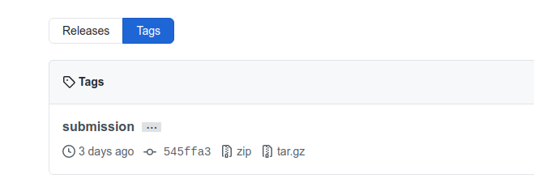
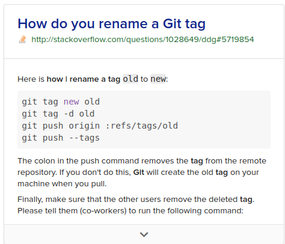
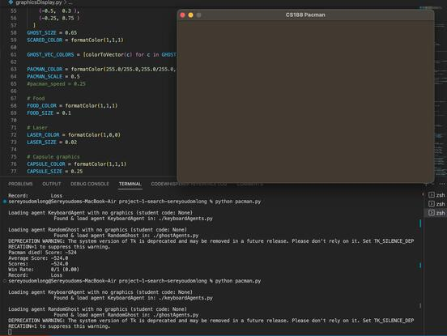
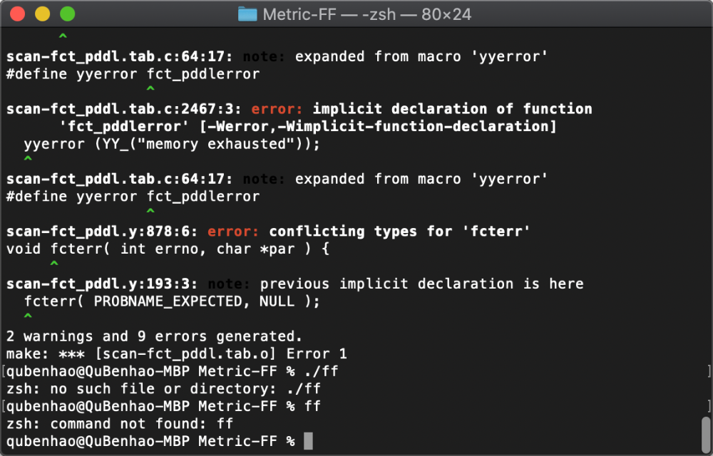
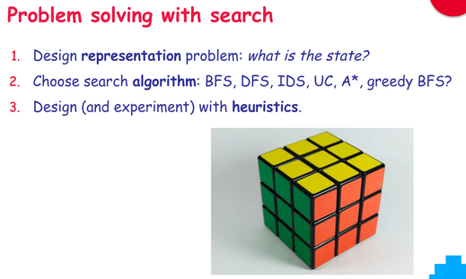

# FAQ - Projects - RMIT AI COSC1125/1127

This is a FAQ for the **project** assessments only.

As any FAQ page, this page is always "under construction". As we realize that some questions become common, we add them here. So, bookmark it and check it regularly, particularly when you have a doubt and you suspect it may have been answered before!

- [FAQ - Projects - RMIT AI COSC1125/1127](#faq---projects---rmit-ai-cosc11251127)
- [GENERAL](#general)
  - [In a code assignment/project, how do I make sure I do not go against academic integrity?](#in-a-code-assignmentproject-how-do-i-make-sure-i-do-not-go-against-academic-integrity)
  - [I submitted wrongly (e.g., didn't tag correctly) and is now after the due date, can you consider my submission?](#i-submitted-wrongly-eg-didnt-tag-correctly-and-is-now-after-the-due-date-can-you-consider-my-submission)
  - [Project specification says "You should code your implementation only at the locations ...." . Does this mean that we can't create our custom classes outside the provided functions?](#project-specification-says-you-should-code-your-implementation-only-at-the-locations---does-this-mean-that-we-cant-create-our-custom-classes-outside-the-provided-functions)
  - [The feedback autograder says _"Your grades are NOT yet registered."_ What should I do to register?](#the-feedback-autograder-says-your-grades-are-not-yet-registered-what-should-i-do-to-register)
  - [Should I pass all the feedback autograder tests?](#should-i-pass-all-the-feedback-autograder-tests)
  - [Why do we need to show good SE/GIT processes?](#why-do-we-need-to-show-good-segit-processes)
  - [Can I just add dummy/padding commits to have more commits?](#can-i-just-add-dummypadding-commits-to-have-more-commits)
- [GIT \& GITHUB](#git--github)
  - [Git, GitHub, what is that?](#git-github-what-is-that)
  - [Can I just use GitHub Desktop instead of command line `git`?](#can-i-just-use-github-desktop-instead-of-command-line-git)
  - [How do I submit my project solution in my GIT repository?](#how-do-i-submit-my-project-solution-in-my-git-repository)
  - [How do I change the submission tag if I have already tagged one commit for submission?](#how-do-i-change-the-submission-tag-if-i-have-already-tagged-one-commit-for-submission)
  - [How do I update the tags in my local repo? I get rejection with "(would clobber existing tag)" message](#how-do-i-update-the-tags-in-my-local-repo-i-get-rejection-with-would-clobber-existing-tag-message)
  - [Is a tag the same as a release in GitHub?](#is-a-tag-the-same-as-a-release-in-github)
  - [Cannot clone or push to GitHub with my password credentials?](#cannot-clone-or-push-to-github-with-my-password-credentials)
  - [I get `Permission denied (publickey).` from GitHub](#i-get-permission-denied-publickey-from-github)
  - [I have committed to the remote repo but I am not listed as a "contributor", why?](#i-have-committed-to-the-remote-repo-but-i-am-not-listed-as-a-contributor-why)
  - [Commits not correctly associated to my GitHub account, why?](#commits-not-correctly-associated-to-my-github-account-why)
  - [I made a bad commit and pushed to repo, how can I undo it?](#i-made-a-bad-commit-and-pushed-to-repo-how-can-i-undo-it)
  - [How do I compare the speed of my desktop/laptop with that from the cluster being used for marking?](#how-do-i-compare-the-speed-of-my-desktoplaptop-with-that-from-the-cluster-being-used-for-marking)
  - [How can I check which GH username I am using for GitHub Classroom in the course?](#how-can-i-check-which-gh-username-i-am-using-for-github-classroom-in-the-course)
- [PYTHON](#python)
  - [What version of Python should I use?](#what-version-of-python-should-i-use)
  - [How do I run Python 3.8 in `coreteachingXX.csit.rmit.edu.au`?](#how-do-i-run-python-38-in-coreteachingxxcsitrmiteduau)
    - [How do I install a package/module in `coreteaching` using `pip`?](#how-do-i-install-a-packagemodule-in-coreteaching-using-pip)
  - [How do I know the type of a variable in Python?](#how-do-i-know-the-type-of-a-variable-in-python)
  - [AttributeError: module 'importlib' has no attribute 'util'](#attributeerror-module-importlib-has-no-attribute-util)
  - [How do I represent infinity?](#how-do-i-represent-infinity)
- [GENERAL PACMAN](#general-pacman)
  - [What is the best way to develop my solutions for the Pacman project?](#what-is-the-best-way-to-develop-my-solutions-for-the-pacman-project)
  - [How to run Pacman remotely from `coreteaching`?](#how-to-run-pacman-remotely-from-coreteaching)
  - [Python libraries and `requirements.txt` file, what are they?](#python-libraries-and-requirementstxt-file-what-are-they)
  - [How do I setup a system in Windows with Python?](#how-do-i-setup-a-system-in-windows-with-python)
  - [Can I use `problem._visited`?](#can-i-use-problem_visited)
  - [I get "`_tkinter.TclError: no display name and no $DISPLAY environment variable`" error when running in WSL or ssh](#i-get-_tkintertclerror-no-display-name-and-no-display-environment-variable-error-when-running-in-wsl-or-ssh)
  - [Cannot run Pacman due to problems with Tkinter: "`ImportError: No module named Tkinter`"](#cannot-run-pacman-due-to-problems-with-tkinter-importerror-no-module-named-tkinter)
  - [I get a blank screen when running Pacman on my Mac, why?](#i-get-a-blank-screen-when-running-pacman-on-my-mac-why)
  - [Can't fit the Pacman window in my screen, can I resize it?](#cant-fit-the-pacman-window-in-my-screen-can-i-resize-it)
  - [Cannot compile Metric-FF in MacOS](#cannot-compile-metric-ff-in-macos)
  - [I get `ModuleNotFoundError: No module named 'func_timeout'`, why?](#i-get-modulenotfounderror-no-module-named-func_timeout-why)
  - [One of the many tests is failing, how can I just run one question or even one particular test only?](#one-of-the-many-tests-is-failing-how-can-i-just-run-one-question-or-even-one-particular-test-only)
  - [My X algorithm (e.g. A\* search) works but it takes too long, what's the best way to work out why it's taking so long/work out how to optimise it?](#my-x-algorithm-eg-a-search-works-but-it-takes-too-long-whats-the-best-way-to-work-out-why-its-taking-so-longwork-out-how-to-optimise-it)
  - [How can I debug my system?](#how-can-i-debug-my-system)
  - [Can I change the pacman infrastructure at run-time?](#can-i-change-the-pacman-infrastructure-at-run-time)
  - [Can I use catch all exceptions in my code, or exceptions from the infrastructure?](#can-i-use-catch-all-exceptions-in-my-code-or-exceptions-from-the-infrastructure)
  - [Should we remove this line `util.raiseNotDefined()` before starting our code or not? What does it do?](#should-we-remove-this-line-utilraisenotdefined-before-starting-our-code-or-not-what-does-it-do)
- [Project 0](#project-0)
  - [Do we have to handle edge cases? For example, for the `shopSmart` function, what should we do if a fruit is _not_ present in one of the shops?](#do-we-have-to-handle-edge-cases-for-example-for-the-shopsmart-function-what-should-we-do-if-a-fruit-is-not-present-in-one-of-the-shops)
- [Project 1](#project-1)
  - [Do we need to do all the "`*** YOUR CODE HERE ***`" method?](#do-we-need-to-do-all-the--your-code-here--method)
  - [Can I import standard libraries?](#can-i-import-standard-libraries)
  - [What actions should I return in the search algorithms?](#what-actions-should-i-return-in-the-search-algorithms)
  - [How can I represent a plan with no actions?](#how-can-i-represent-a-plan-with-no-actions)
  - [What counts as an expansion? I am getting too many expansions....](#what-counts-as-an-expansion-i-am-getting-too-many-expansions)
  - [My solution works manually for `tinaMaze` but the authograder fails. The state format used in the autogarders tests are different from the Pacman game's in `tinaMaze`. What happens here?](#my-solution-works-manually-for-tinamaze-but-the-authograder-fails-the-state-format-used-in-the-autogarders-tests-are-different-from-the-pacman-games-in-tinamaze-what-happens-here)
  - [In Q7, can I take a heuristic from elsewhere (e.g., Google) and implement it?](#in-q7-can-i-take-a-heuristic-from-elsewhere-eg-google-and-implement-it)
  - [In Q7, what timeout will be used? How do I know what timeout should I use?](#in-q7-what-timeout-will-be-used-how-do-i-know-what-timeout-should-i-use)
  - [Are we allowed to use `mazeDistance` (or a modified version) when calculating our heuristic?](#are-we-allowed-to-use-mazedistance-or-a-modified-version-when-calculating-our-heuristic)
  - [Can we create a new BFS for the part 5? My implementation doesn't fit with my new state representation!](#can-we-create-a-new-bfs-for-the-part-5-my-implementation-doesnt-fit-with-my-new-state-representation)
  - [Break-points do not work on `search.py`, why?](#break-points-do-not-work-on-searchpy-why)
  - [In the feedback autograder, what does `expanded_states` means?](#in-the-feedback-autograder-what-does-expanded_states-means)
  - [What we should return for the failure case, ie. when no path can be found?](#what-we-should-return-for-the-failure-case-ie-when-no-path-can-be-found)
-------------------------

# GENERAL

## In a code assignment/project, how do I make sure I do not go against academic integrity?

Check the [answer to this key question here](../AI23-DOC.git/CODE-INTEGRITY.md)

## I submitted wrongly (e.g., didn't tag correctly) and is now after the due date, can you consider my submission?

We will not fix any submission and it is your responsibility to do it correctly.

However, the nice thing about git-based projects/assessments is that we can rely on commits. If you have submitted your tag incorrectly (did not tag it at all, tagged with different name or different capital letters), then please fix your submission by tagging the specific commit you want me to mark. I will use the timestamp of the commit itself, not of when it was tagged. This means that if the commit was done before the deadline, then all good!! Isn't this cool?

## Project specification says "You should code your implementation only at the locations ...." . Does this mean that we can't create our custom classes outside the provided functions?

Yes, you can create some help functions or classes, but **always** in the allowed files. Any other change in any other file will be totally ignored.

If you want to create custom classes and functions, you can also nest them inside the location where you read `***YOUR CODE HERE***`. See [this link](https://www.datacamp.com/community/tutorials/inner-classes-python) and [this link](https://www.programiz.com/python-programming/closure#:~:text=A%20function%20defined%20inside%20another,in%20order%20to%20modify%20them) for more info.

## The feedback autograder says _"Your grades are NOT yet registered."_ What should I do to register?

The autograder is some immediate **feedback** for you, but it is not the final grading we do as teaching staff.

So, while the automarker is a useful indication of your performance, it may not represent the ultimate mark. We reserve the right to run more tests, inspect your code and repo manually, run similarity software for integrity checks (this year via [Codequiry](https://codequiry.com/)), and arrange for a face-to-face meeting for a discussion and demo of your solution if needed.

After submission deadline we will mark them all and provide you with the results.

## Should I pass all the feedback autograder tests?

Well, if you want to have a chance to get full marks _yes_.

Basically, the feedback autograder given is the _bare minimum_ and it is meant to provide you with some help in you development. In fact, even if your solution does meet every feedback test case given, it still does not necessarily mean it is perfect, as we may run additional tests when we actually grade the submission. Again, the autograder is an invaluable feedback tool for development and is the bare minimum, but more will be asked. You are encourage to extend it with your own tests and to perform your own extended efficiency evaluation when appropriate.

We are aware that it can be a bit unforgiving to work with the automated test harness, but often your understanding of the underlying algorithms are greatly improved when you need to dig into particular corner cases, so it's time well spent.

As recognised by students, the autograder is indeed a fantastic feedback before submission for you. It is the minimum expected and you have it right from the start, so use it!

## Why do we need to show good SE/GIT processes?

It is a fair question: _why don't we just care about the AI algorithm and that's it?_

There are, at least three reasons to include SE and version control practices as part of the work and assessments of the course:

1. It is the way AI software and solutions are developed these days. Hence, good SE practices, and particularly version control, is part of the overall training we promote in our courses, particularly in advanced courses.
2. We want to be able to see evidence of _student workings_ towards the final solution, not just the solution. This is analogous to math assessments say: we want to know how you got to that, not just the final answer. It is normal in math that when workings are asked, a solution without workings will get no marks.
3. Good SE and version control will be _fundamental_ for the final contest project in order to be _productive_. This is because it is a large task and in teams, so using poor SE and git processes will be a serious obstacle.
   - This means that it is important to promote and enforce good practices from the initial, smaller, project assignments, so that we increase the chances good practices in the final project. The initial projects thus serve as strong signals that hopefully will result in better outcomes in the larger assessment task.

## Can I just add dummy/padding commits to have more commits?

**No!**

That will not only show very poor SE practices (because dummy commits are not meaningful commits), but most importantly it may be deemed as a case of "_dishonest behavior to get an unfair advantage_", which is against the course Honours Code and can be a serious offense. One thing is to have poor SE practices, another thing is to attempt to cheat, so that should be out of the question! :-)

------------------------------
# GIT & GITHUB

## Git, GitHub, what is that?

We will use proper (git) version control in all our programming projects. This is totally standard practice in the industry and you would have seen that in previous courses (SEF and SEPT at least). Said so, if you want to refresh or have a quick intro to it, here are two resources I found useful:

- [30' video on Git & GitHub](https://youtu.be/jG4Vs81kMlc).
- [GitHub Guides](https://guides.github.com/).
- [Git \& GitHub Tutorial & Reference @ Javatpoint](https://www.javatpoint.com/git).

There are lots more good resources on the web of course!

## Can I just use GitHub Desktop instead of command line `git`?

You can use it, as long as you are also able to resort to command line `git` when needed.

GitHub Desktop, or any other programming tool like a text editor/IDE, package manager, etc, have strengths and limitations. While using GitHub Desktop is not inherently bad, as long as it is fit for your purpose and provides an efficient workflow, there is value in having an understanding how the tools work, because that will help you when they fail or you reach their limits. But as long as you are confident that you could understand the underlying details if you needed to, all good! 👍

Now, if you are using GitHub Desktop just because you do not know how to use git command line, then that is ineed not good enough (both in terms of skills and attitude) for a student taking this course, and a CS/IT student overall anwyays. You are expected to be able to know git more than its high-level tools, and to learn whatever gaps you have. 😉

Critically, you will not get help from staff about how to use GitHub Desktop, since we (or at least most of us) don't use it. 🤦


## How do I submit my project solution in my GIT repository?

You submit by **tagging the _exact_ commit that you want to submit and be marked**, using the exact name given in the assignment specification. We will ONLY marked tagged submissions and will ONLY mark the tagged commit. Students can have many commits, and branches, even commits after the deadline. We will mark ONLY what you submit.

Of course we do not have access to your local machine, so the tag has to be created locally or then _pushed_ into GitHub remote repo (see below for several guides). Your tag has to show under `tags`, for example:



Observe that a tag `submission` is:

- NOT the same as a tag called "`Submission`" (i.e., tags are case-sensitive);
- NOT the same as a _branch_ called "`submission`";
- NOT the same as a _commit message_ "`submission`"; and
- NOT the same as a _release_ called "`submission`".

A tag is a specific point in the repository history, the point you want to be used for marking. A branch, a comment, and a release are different things.

While you can tag from your IDE (e.g., VS Code) you can always resort to command line to first create the tag in your local repo and then push it to the remote:

```shell
$ git tag -a submission <hash of commit to tag>
$ git push origin submission
```

Check the remote has the tag where you wanted!

Note that _a tag name can only be used once_, so if you already have a tag `submission` and want to use that tag name on another commit (e.g., you have a better, more recent, commit for your solution), you first need to delete the existing tag; see the next question for that. :-)

- For basic information on tagging, check [here](https://git-scm.com/book/en/v2/Git-Basics-Tagging).
- To create, push, and view tags in GitHub Desktop, check [here](https://docs.github.com/en/desktop/contributing-to-projects/managing-tags).
- To tag via command line or via GitHub web interface, check [here](https://stackoverflow.com/questions/18216991/create-a-tag-in-a-github-repository).

Note that the timestamp of the _commit_ is the submission date.

## How do I change the submission tag if I have already tagged one commit for submission?

This will happen when you realize you have a better version to submit than the one you submitted/tagged before. To do that, you need to first _delete_ the existing tag from both your local repo and from the server:

```shell
$ git tag --delete <tagname>  # first delete tag in the local repo
$ git push origin :refs/tags/<tagname>  # then delete remote tag
```

It is important to use `:refs/tags` when deleting the remote tag, as otherwise you may delete the branch with the same name! The empty string to the left of the colon causes the remote reference to be deleted!

Once the tag has been fully deleted, so you can re-use it on another commit!

See this as well on how to _rename_ an existing tag:



More information on how to delete git tags [here](https://devconnected.com/how-to-delete-local-and-remote-tags-on-git/).

## How do I update the tags in my local repo? I get rejection with "(would clobber existing tag)" message

To fetch the tags in the remote (e.g., tags pushed by other collaborators), you can do:

```shell
$ git fetch --all --tags -f
```

This will fetch all the changes from the remote, but also all the tags. The `-f` option will replace an existing tag (e.g., `submission`) with the one in the remote, if any (instead of failing). This could come very handy when different collaborators tag and re-tag commits as they incrementally work on a solution.

## Is a tag the same as a release in GitHub?

No, a _tag_ is a _git concept_, whereas a `Release` is something about GitHub, beyond git itself. So, they are not synonymous.

A tag is a _pointer_ to a specific commit, that's all, you basically give a name to a specific commit. This is what we use to mark the commit that is meant to be submitted for marking.
## Cannot clone or push to GitHub with my password credentials?

As [per August 12th, 2021 GitHub post](https://github.blog/changelog/2021-08-12-git-password-authentication-is-shutting-down/), GitHub is not no longer accepting account passwords when authenticating Git operations, like cloning private repos or pushing changes. You should use **token-based authentication**, such as  personal access, OAuth, SSH Key, or GitHub App installation token.

So, if you were still using a password to authenticate your GitHub.com operations (something never recommended anyways if you are doing development), you must start using a [personal access token](https://docs.github.com/en/github/authenticating-to-github/keeping-your-account-and-data-secure/creating-a-personal-access-token) by August 13, 2021 via HTTPS (recommended) or [SSH key](https://docs.github.com/en/github/authenticating-to-github/connecting-to-github-with-ssh) to start using a personal access token to avoid disruption.

For example, you can set-up your remote as follows (after you generated your token in GitHub):

```shell
$ git remote set-url origin https://<token>@github.com/<username>/<repo>
```

As explained [here](https://www.sobyte.net/post/2021-08/github-deprecates-passwords-for-git-operations/), tokens offer many advantages over password-based authentication:

* **Unique:** tokens are specific to GitHub and can be generated on a per-use or per-device basis.
* **Revocable:** tokens can be individually revoked at any time without the need to update unaffected credentials.
* **Limited:** tokens can be narrowed to allow only the access required by the use case.
* **Random:** tokens are not subject to dictionary types or brute force attempts that might be made with simpler passwords that users need to remember or enter periodically.

## I get `Permission denied (publickey).` from GitHub

If yo get this error

```shell
git@github.com: Permission denied (publickey).
fatal: Could not read from remote repository.
```

it most probably mean you have not correctly set-up your ssh keys into GitHub. GitHub needs your ssh public key to know it's you who is trying to access the repo. Please check [here](https://docs.github.com/en/authentication/troubleshooting-ssh/error-permission-denied-publickey).

Setting up GitHub to access with token or ssh is fundamental to have a productive environment, as you will be pushing and pulling from GitHub a lot! :-)

## I have committed to the remote repo but I am not listed as a "contributor", why?

The two main reasons may be:

1. Your commit is in a branch and has not yet made it to the default (master/main) branch, therefore you did not technically contribute (yet).
2. Your local Git commit email isn't connected to your account; [connect it](https://docs.github.com/en/github/setting-up-and-managing-your-github-user-account/managing-email-preferences/setting-your-commit-email-address)!

Read [this GitHub page](https://docs.github.com/en/github/setting-up-and-managing-your-github-profile/managing-contribution-graphs-on-your-profile/why-are-my-contributions-not-showing-up-on-my-profile#common-reasons-that-contributions-are-not-counted) to understand more about why your commit is not yet counting as contributions.

## Commits not correctly associated to my GitHub account, why?

Please [check this](https://docs.github.com/en/github/committing-changes-to-your-project/troubleshooting-commits/why-are-my-commits-linked-to-the-wrong-user) and fix it so we can know the commit was *yous*. Otherwise we may get your contributions wrong and risk getting lower marks or delaying your marking.

Note that when you [set your email address in git in your machine](https://docs.github.com/en/account-and-profile/setting-up-and-managing-your-personal-account-on-github/managing-email-preferences/setting-your-commit-email-address#setting-your-commit-email-address-in-git) you can do it globally, or per repo. The latter would be useful if you are using different GH usernames for different projects/repos (e.g., for different courses, or personal projects).

## I made a bad commit and pushed to repo, how can I undo it?

You should use `git revert`. That is, if you  pushed your changes and you now want to go back to the previous version, use this (assuming you are working on the `main` branch):

```shell
$ git revert HEAD~1
$ git push origin main
```

This states that you want to revert the changes to `HEAD` by `1` commit (the last commit), make a new commit that undoes those changes, and then push this new commit to the origin branch, in this case the `main` branch. Of course you can imagine how to undo back more than 1 commit, right? ;-)

Read more about `git revert` [here](https://www.atlassian.com/git/tutorials/undoing-changes/git-revert).

## How do I compare the speed of my desktop/laptop with that from the cluster being used for marking?

In general the cluster is not very fast, hence it won't be a surprise if your laptop runs faster.

You can compare the relative speed of your machine against the cluster using [python-speed](https://github.com/vprelovac/python-speed).

This is what I get in the cluster:

```shell
$ python bench.py
python-speed v1.3 using python v3.10.6
string/mem: 2181.89 ms
pi calc/math: 2979.85 ms
regex: 3508.85 ms
fibonnaci/stack:  2791.22 ms
multiprocess: 1468.98 ms

total:  12930.8 ms (lower is better)
```

And this is what I get from my laptop:

```shell
$ python bench.py
python-speed v1.3 using python v3.10.12
string/mem: 1044.85 ms
pi calc/math: 2012.68 ms
regex: 1722.82 ms
fibonnaci/stack:  995.85 ms
multiprocess: 484.14 ms

total:  6260.34 ms (lower is better)
```

As you can see my laptop is ~2x faster than the cluster machines.

So, _how fast is your laptop_?


## How can I check which GH username I am using for GitHub Classroom in the course?

The GitHub username you selected is in the name of all of the projects you clone. (e.g. if the repo is called `project-1-search-<username>`, then you used GH `username` account). This is the account with which you should make commits with so we can link them to you through classrooms. You must then have your GIT configuration to commit with such user so that your commits are counted as yours. See [this question](#i-have-committed-to-the-remote-repo-but-i-am-not-listed-as-a-contributor-why) as well.

------------------------------
# PYTHON

## What version of Python should I use?

All projects run on **Python 3.9+**, so your code must be written for such a version. We use Python 3.10. Note that Python 3.8 is [ending its support these days](https://devguide.python.org/versions/).

Some Linux distributions come with both `python2` and `python3` installed but default to `python2` for the python command. In this case, you should use the `python3` command in place of python to explicitly use version 3.x.

Additionally, in order to render the game, the homework projects require the Python module `tkinter` to be installed. You can follow the [official docs](https://tkdocs.com/tutorial/install.html) to get `tkinter` on your platform if it is not installed already. If you are using Linux, many distributions have packaged `tkinter` for easy install and you should use the package manager to install it. The package name is `python3-tk` for Debian/Ubuntu, `python3-tkinter` for RHEL/Fedora and `tk` for Manjaro/Arch.

There is no problem **having more than one Python version installed in your machine**, you just need to be careful your code is using the right one. You can use Python Package and Environment Managers, such as [Conda](https://www.freecodecamp.org/news/why-you-need-python-environments-and-how-to-manage-them-with-conda-85f155f4353c/) or [miniconda](https://conda.io/miniconda.html) environments, or an environment with [PIP+virtualenv](https://uoa-eresearch.github.io/eresearch-cookbook/recipe/2014/11/26/python-virtual-env/).

## How do I run Python 3.8 in `coreteachingXX.csit.rmit.edu.au`?

We do not recommend using those servers, they are fairly out-of-date and you have very little control over them (e.g., what you can install). These days the best option is to use your own machine/laptop.

The default Python in these servers is 2.7! 🤦 However, you can activate 3.6 and 3.6 using `scl`:

```bash
[eXXXXX@csitprdap01 ~]$ scl enable rh-python38 bash
[eXXXXX@csitprdap01 ~]$ python --version
Python 3.8.18
[eXXXXX@csitprdap01 ~]$ python
Python 3.8.18 (default, Oct 24 2023, 08:42:25)
[GCC 9.1.1 20190605 (Red Hat 9.1.1-2)] on linux
Type "help", "copyright", "credits" or "license" for more information.
>>>
```


### How do I install a package/module in `coreteaching` using `pip`?

Use option `--user` as you cannot do system-wide install:

```shell
[eXXXX@csitprdap01 ~]$ pip install pytz --user
WARNING: pip is being invoked by an old script wrapper. This will fail in a future version of pip.
Please see https://github.com/pypa/pip/issues/5599 for advice on fixing the underlying issue.
To avoid this problem you can invoke Python with '-m pip' instead of running pip directly.
Collecting pytz
  Using cached pytz-2022.1-py2.py3-none-any.whl (503 kB)
Installing collected packages: pytz
Successfully installed pytz-2022.1
```

## How do I know the type of a variable in Python?

Check this video to know how to print the type of a variable in Python:

[](https://www.youtube.com/watch?v=iROZLaQGy4s)

## AttributeError: module 'importlib' has no attribute 'util'

Some students reported that running `python capture.py` gives them the following errors:

```shell
Traceback (most recent call last):
  File "capture.py", line 1127, in <module>
    options = readCommand( sys.argv[1:] ) # Get game components based on input
  File "capture.py", line 902, in readCommand
    redAgents = loadAgents(True, options.red, nokeyboard, redArgs)
  File "capture.py", line 978, in loadAgents
    spec = importlib.util.spec_from_loader(moduleName, loader)
AttributeError: module 'importlib' has no attribute 'util'
```

Changing `import importlib` with `import importlib.util` seems to fix the problem.

We are still investigating this issue as it seems to work well in our set-up. This seems to be related to the fact that ["importing a package does not automatically load its submodules"](https://stackoverflow.com/questions/65028261/attributeerror-module-importlib-has-no-attribute-util-ii) but we are unclear why sometimes it does work! A quick search also brings [this post](https://stackoverflow.com/questions/39660934/error-when-using-importlib-util-to-check-for-library) which may be

## How do I represent infinity?

The best way is to use [`math.inf`](https://docs.python.org/3/library/math.html#math.inf). Python can handle arbitrarily large numbers, and so `math.inf` is both correct and also meaningful for the reader.

**Note:** avoid using `sys.maxsize`; you can check what happens if you do `sys.maxsize < sys.maxsize*2`. :-)

------------------------------
# GENERAL PACMAN

## What is the best way to develop my solutions for the Pacman project?

We highly recommend developing your solutions in your local machine, that is, your laptop or desktop. Even more, if you are running Linux locally, 99.99% sure your code will ran in another Linux install. If you are using Windows, you may want to consider installing a Linux virtual machine with Virtualbox.

Secondly, you should use a modern IDE. We recommend Visual Studio Code, as it runs in any platform and has plugins for all the languages we will be using. It also has great git integration plugins and much more.

Also, all development should be done using high-quality version control processes. The course will use GitHub and GitHub Classroom. All development should happen there. Remember NOT to make your solutions public, as this will violate the course plagiarism code AND also break the will of the original creators of the wonderful project.

So, (local machine + VSCode (or other IDE) + git) will make the development much faster and higher-quality.

## How to run Pacman remotely from `coreteaching`?

If you do not care about the graphics (e.g., for grading), then try using `--textGraphics` or even `--quietTextGraphics`. In most cases you will use `coreteaching` machines just to test that the autograder works well. The autograder does not need any graphical interface so it should work properly.

If you do want the display, then you need to do X forwarding when you connect via ssh. If you are in Linux/Unix this is easy, just do `-X` and `-Y` when you ssh; for example:

```shell
$ ssh -X -Y username@coreteaching01.csit.rmit.edu.au
```

If you use Windows, then you need an X server running and set your ssh client (e.g., Putty) with X forwarding. For example, check [this page](https://superuser.com/questions/119792/how-to-use-x11-forwarding-with-putty) or this video:

[](https://www.youtube.com/watch?v=vwZXhTykSis)

Said so, for development, we strongly suggest to clone your repo locally on your machine and work there (e.g., using PyCharm, Visual Code Studio, or even ECLIPSE).

## Python libraries and `requirements.txt` file, what are they?

The file `requirements.txt` should have the libraries that are required, you can get these modules running:

```shell
$ pip install -r requirements.txt
```

You will see in some other questions in this FAQ that some errors are because the system is missing some library (like `tk` for the graphical display).

## How do I setup a system in Windows with Python?

Although we will assume you are able to install and get Python running in your machine, there are plenty of videos on that on the web. For example:

[](https://www.youtube.com/watch?v=oHOiqFs_x8Y)

## Can I use `problem._visited`?

Under Python convention, single underscore before a name (e.g., `_visited`) denotes private data, and hence it is good practice not to rely on such data. Check [this post](https://shahriar.svbtle.com/underscores-in-python) for example. Note that such private data can change without notice, it may not be available anymore, it may not be available under other interfaces, etc. So....

## I get "`_tkinter.TclError: no display name and no $DISPLAY environment variable`" error when running in WSL or ssh

If you do not care about the graphics, then try using `-t` (or `--textGraphics`) or even `-q` (or `--quietTextGraphics`).

If you do want the display, then you need to do X forwarding when you connect via ssh. If you are in Linux/Unix this is easy, just do `-X` and `-Y` when you ssh (e.g., `ssh -X -Y server`).

If you use Windows, then you need an X server running and set your ssh client (e.g., Putty) with X forwarding. For example, check [this page](https://superuser.com/questions/119792/how-to-use-x11-forwarding-with-putty) and [this video](https://www.youtube.com/watch?v=vwZXhTykSis).

Also, if you are using Windows hooked up into Linux (WSL or WSL2), you need to properly resolve the IP Address seen by Linux. For example, under Ubuntu bash, add this to your `~/.bashrc`:

```shell
export DISPLAY=$(cat /etc/resolv.conf | grep nameserver | awk '{print $2}'):0
```

Then install the [VCXSRV](https://sourceforge.net/projects/vcxsrv/files/vcxsrv/) X-server. Run xLaunch and "Disable access control". And add a new inbound rule in Windows Firewall for TCP Port 6000.  Use the ssh command as above.

As you can see, all these can be too complicated for no benefit. For development, **we strongly suggest** to clone your repo locally on your machine and work there (e.g., using PyCharm, Visual Code Studio).

## Cannot run Pacman due to problems with Tkinter: "`ImportError: No module named Tkinter`"

Install Tkinter in your system. In general this is easy to do via:

```shell
$ pip install tk
```

Now it should be installed, so you should not get this error. But please try the code below, it should not trigger any error:

```shell
❯ python
Python 3.10.12 (main, Mar 22 2024, 16:50:05) [GCC 11.4.0] on linux
Type "help", "copyright", "credits" or "license" for more information.
>>> import tkinter
>>>
```

If you are running `conda`:

```bash
$ conda install tk
```


## I get a blank screen when running Pacman on my Mac, why?

If you get something like this on your Mac:



This may be due to using Python 2.7. Any Mac users, make sure to run `python3 pacman.py` (or otherwise ensure you are using Python 3, not 2.x).
Another cause seems to be related to using the wrong virtual environment. From a student:
"To resolve this, I switched to using the Python 3.9 virtual environment as the interpreter, which corrected the issues.
I initially tried using Pyenv with Python 3.9, but it still didn't work. Then I switched to Conda, and surprisingly, everything started working fine."

## Can't fit the Pacman window in my screen, can I resize it?

The Pacman windows cannot be resized once open. However, you can use the option `-z <float>` (or `--zoom <float>`) to scale the window. For example, using `-z 0.5` will scale down the window by half. Using this option you should be able to fit the entire window in the screen.

## Cannot compile Metric-FF in MacOS

Some Mac users have reported this error when compiling [Metric-FF](https://fai.cs.uni-saarland.de/hoffmann/metric-ff.html) planner:



The problem seems to be that the default `gcc` in Mac is set to be `clang`. So, you first neeed to install standard `gcc` on using command `brew install gcc@7`  (must use version 7, newest version 10 won't work) and instead of just `make`, you need to run:

```bash
make CC=/usr/local/bin/gcc-7
```

Thanks Banhao from AI'20!

## I get `ModuleNotFoundError: No module named 'func_timeout'`, why?

This should be easy to troubleshoot, but there are certain Python packages/modules that are needed:

```shell
$ pip install func_timeout
$ pip install pytz
```

## One of the many tests is failing, how can I just run one question or even one particular test only?

Use the `-q n` option for running just one question (e.g., `-q q3` to run Question 3 only) or `-t` to run only a specific test (e.g., `-t test_cases/q1/graph_bfs_vs_dfs`).

## My X algorithm (e.g. A* search) works but it takes too long, what's the best way to work out why it's taking so long/work out how to optimise it?

Fundamentally there are two ways of approaching this, empirically or theoretically.

Empirically you can profile your code and see which sections are taking the longest. If you have a particular section that you suspect might be the issue, you can use the time module to check manually. However probably the better way is to use pythons inbuilt `cprofile` tool. This works well, especially when paired with [Snakeviz](https://stackoverflow.com/a/49173782). There is also
[line_profiler](https://github.com/pyutils/line_profiler) which profiles line by line showing line time, total line time and number of calls.

Theoretically, you can use your algorithms and analysis skills to try to figure out the time complexity of your algorithm. If your code matches the book, it should have a similar time complexity, but you may want to dig a bit deeper into each individual line of code. What is the time complexity of popping from a priority queue in python? What about a list? What about adding a node to the frontier, or visited data structure?

In general, before spending a lot of time doing experimental analysis, look at your implementation conceptually in a very, I repeat, _very_, critical way and perform the (theoretical) analysis of it. Think where the problem could be and whether you can suspect of something that is not well done. It's like being a detective, and good detectives are critical and meticulous!

## How can I debug my system?

While you may want to do some print outs here and there, eventually using a debugger is the way to go. Check [this video](https://www.youtube.com/watch?v=w8QHoVam1-I) for a quick guide to debugging python in VSCode (you can do similar things in PyCharm or other editors as well). This is far more flexible and reliable than print messages. :-) 

To make life easy for yourself, you will want to create a debugging configuration in VSCode which runs the autograder file, regardless of which file you have open. You will also want to pass in the arguments `-q q1` to run only the first question (or whichever you are interested in). You can accomplish this by adding the following text to the `launch.json` file which stores all the debug configurations:
```json
      {
          "name": "Python Debugger: autograder",
          "type": "debugpy",
          "request": "launch",
          "program": "autograder.py",
          "console": "integratedTerminal",
          "args": [
              "-q",
              "q1"
          ]
      }
```

## Can I change the pacman infrastructure at run-time?

**Absolutely no!** You should never tamper with the Pacman codebase infrastructure in any project, neither at the source code level nor at run-time. That is not allowed for any project: your agent systems should alter anything in the infrastructure, even at runt-time, unless you have been given explicit permission in writing.

As a general rule, reading properties of the infrastructure is OK and you will need to do so indeed. But **modifying the infrastructure at run-time in any way is not OK**. First it is poor technical approach to rely on that. Second, it may _unfairly_ give you an advantage, and in the contest project, may even affect other teams; for example by making them fail!

For example, doing this in the contest project:

```python
Actions._directions.pop('Stop', None)
```

will delete the action `Stop` from the set of legal directions. That is of course NOT allowed as you are tampering with the infrastructure, not just with your own code. Instead, you should do something like this:

```python
# Get legal actions from the agent and remove "Stop"
actions = gameState.getLegalActions(self.captureAgent.index)
actions.remove(Directions.STOP)
```

Here is another example that interferes badly with the infrastructure:

```python
agent.configuration.direction = "North"
```

This is setting a property of the agent: that is done by the infrastructure as part of the simulation and you should not interfere.

Even a more serious one would be to override `makeObservation` or any other function or class in the infrastructure. Never ever do that.

In fact, tampering with the infrastructure could be considered as dishonest behavior to get an unfair advantage. If you are in doubt, then ASK, never assume. Not asking before tampering with the codebase is in fact very worrying, even more for an advance course like AI.

We have specialized checks to test that the infrastructure is kept unchanged.

So please, remove absolutely every code that modifies, changes, or alter, even minimally, any part of the infrastructure and make sure you play _fair_ and don't make Pacman cry...

## Can I use catch all exceptions in my code, or exceptions from the infrastructure?

**Absolutely no!** It is first a very [bad practice](https://www.learnpython.dev/03-intermediate-python/40-exceptions/70-best-practices/#:~:text=Catching%20BaseException%20is%20a%20really,Don't%20do%20it.), as stated in PEP-8 and so many pages around:

> When catching exceptions, mention specific exceptions whenever possible instead of using a bare `except:` clause.

So, instead of doing:

```python
try:
    import platform_specific_module
except:
    platform_specific_module = None
```

you should instead do

```python
try:
    import platform_specific_module
except ImportError:
    platform_specific_module = None
```

You can see there that I am catching the specific `ImportError` exception (not any exception!), which is what could happen when I execute the `import` statement.

For the same reason, you should never catch `Exception` or `BaseException`, or any exception raised by the Pacman infrastructure itself (as the ones used for tracking timeouts). This would amount to tampering with the Pacman infrastructure, which is pretty bad (check question above on that).

Most solutions won't require catching any exception, but if you happen to do/need so, you must catch specific exceptions and not the ones of the Pacman infrastructure.

## Should we remove this line `util.raiseNotDefined()` before starting our code or not? What does it do?

Yes, you should remove it - to figure out what it does I encourage you to look up its definition in `util.py` ;-)

-----------------
# Project 0

## Do we have to handle edge cases? For example, for the `shopSmart` function, what should we do if a fruit is _not_ present in one of the shops?

For this project only (Project 0), since it is just designed to get you warmed up with python and git, you do not need to consider edge cases which are not mentioned in the project spec.

Specifically:

* for Q2, you should handle the case where the price list does not contain a fruit in the order, and return `None` as specified.
* for Q3, you do not need to handle the case where the shop does not contain one of the fruits in the order - you can assume _all_ shops will have all relevant fruit.

Having said that, for your own benefit, this is a great question to be thinking of, and you should feel free to handle the edge case if you would like. This is a great bonus activity that introduces you to some of the subtleties inherent in working with existing code-bases.

Note that, for all future projects you should consider edge cases carefully and handle them appropriately, even if we do not say so explicitly in the project spec. This is a critical skill for programming and will really test your detailed knowledge of the underlying algorithms that you will see in this course.

**Note:** in principle, a shop that misses one item in the order would just need to be ignored and not considered. However, this would mean that code in `shop.py` would have to be altered (which goes against what UC's specification!), because the predefined shop class contains its own function `getPriceOfOrder`, which does _not_ handle missing fruit in the way that Q2 requires.

One could import the function from Q2 and use that instead, but the function signatures then won't match, so one needs to create a wrapper in Q2 anyway, and it all gets a bit messy. Fundamentally if you use `getPriceOfOrder`, it will give wrong results for any shops which don't stock all your fruit, but that does seem to be the intended solution.


-----------------
# Project 1

## Do we need to do all the "`*** YOUR CODE HERE ***`" method?

Not really. Just those parts that are relevant for the questions in the assessment.

Some parts are extension that may not be used in a particular edition of the course. For example, in the 2022 edition you don't have to complete `capsuleProblemHeuristic`.

## Can I import standard libraries?

Yes, as long as they are reasonable and do not contradict the spec. For example, importing `sys` to access `sys.maxsize` would be totally fine. Do not import libraries, though, that you wouldn't expect any Python install to include. Or do not use libraries or classes that go against the spec, for example by not using the data structures provided to you in `util.py`!

## What actions should I return in the search algorithms?

Check the actions in this class in `games.py`

```python
class Directions:
  NORTH = 'North'
  SOUTH = 'South'
  EAST = 'East'
  WEST = 'West'
  STOP = 'Stop'
```

## How can I represent a plan with no actions?

Either with an empty list or with a list with just action `Stop`.

## What counts as an expansion? I am getting too many expansions....

Basically, every time you call `problem.getSuccessors(.)`.

(It is not popping out from the queue, as we don't have access to that part of your code!)

So be careful not using that function for more than what is needed. When debugging, be careful, you may introduce [Heisenbug](https://en.wikipedia.org/wiki/Heisenbug)! :-)

One can implement the various search algorithms (e.g., DFS) doing one call to `getSuccessor()` per loop/node, as in the pseudo-code (e.g., book or slides).

## My solution works manually for `tinaMaze` but the authograder fails. The state format used in the autogarders tests are different from the Pacman game's in `tinaMaze`. What happens here?

Indeed, the test cases often have atomic states instead of `(x,y)` coordinates, but this should not affect your code at all. From the algorithms perspective, a state is (just) a "state", regardless of the representation. The autograder often checks corner cases which are not tested by the standard
mazes, which may be why you see it failing (despite your manual cases working).

## In Q7, can I take a heuristic from elsewhere (e.g., Google) and implement it?

The objective of the exercise is NOT to program in Python a solution that somebody else has invented/created. The fact is that we are not testing Python here or even coding skills per se alone. We are learning how to come up/create good heuristics ourselves, by thinking about the domain at hand and the way search works.

What we are interested in assessing for this question is your ability to understand what heuristics are and design them yourself. As a result, while searching online for heuristics **in general** would be fine (but we doubt useful here if you read the book), searching for a heuristic, even at a conceptual level, for this particular problem is definitively **not** OK.

Think about what some relaxations of the problem are, and how you might design a heuristic from those. There are a number of quite simple heuristics that do quite well, as well as some more sophisticated ones.

## In Q7, what timeout will be used? How do I know what timeout should I use?

The key point to understand here is *why do we use heuristics after all?* We use heuristics to guide the search---informed search---so that it runs _faster_.

OK, but _faster than what?_ Well, at least faster than if we do not use a heuristic, right? So, we can set the heuristic to just be `0` (by just doing `return 0` at the top of function `foodHeuristic`) and see how much it would take by running:

```shell
$ python pacman.py -l trickySearch -p AStarFoodSearchAgent -q

Path found with total cost of 60 in 1.9 seconds
Search nodes expanded: 16688
Pacman emerges victorious! Score: 570
Average Score: 570.0
Scores:        570.0
Win Rate:      1/1 (1.00)
Record:        Win
```

So it takes 1.9 seconds when running the agent with an "empty" heuristic. What happens when we plugged our heuristic?


```shell
$ python pacman.py -l trickySearch -p AStarFoodSearchAgent -q

Path found with total cost of 60 in 0.2 seconds
Search nodes expanded: 255
Pacman emerges victorious! Score: 570
Average Score: 570.0
Scores:        570.0
Win Rate:      1/1 (1.00)
Record:        Win
```

As one can see the time was cut down to just 0.2 seconds (10% of the time when no heuristic is used!) and the number of nodes expanded to just 255. Note this is a very powerful heuristic (it expanded only 255 nodes!), and we are not expecting this to get full marks. There are very fast implementations taking 0.5secs and expanding ~1500 nodes, way below the 7000 mark!

So, the question is not just whether the heuristic reduces the number of expansions, but also, ultimately, the search time.

When solving this question consider:

1. How good is your A* implementation?
2. How good is your heuristic?

Basically you are after a good enough A* implementation and a heuristic that _significantly improves_ A* when used without heuristic.

Remember that a heuristic is useful, only if gives benefit over not using it; otherwise what is the point of it? If your heuristic expands very few nodes, BUT it takes a lot of time to compute, then the heuristic will not be beneficial after all. Consider, what would be the very best heuristic you can use (but not useful)? ;-)

Finally, take note of the comment in the source code:

```
If you want to *store* information to be reused in other calls to the
    heuristic, there is a dictionary called problem.heuristicInfo that you can
    use. For example, if you only want to count the walls once and store that
    value, try: problem.heuristicInfo['wallCount'] = problem.walls.count()
    Subsequent calls to this heuristic can access
    problem.heuristicInfo['wallCount']
```

This could be a deal breaker and could move your heuristic performance from 30secs to 1sec.

## Are we allowed to use `mazeDistance` (or a modified version) when calculating our heuristic?

Yes, you certainly can, which is why it says the following in the comments:


> This might be a useful helper function for your ApproximateSearchAgent.

Be careful though - it is easy to imagine that if you call a function to do something, it is 'free', but if you look at the code in that function, you will soon realise that this function may take a lot of time itself. :-)

## Can we create a new BFS for the part 5? My implementation doesn't fit with my new state representation!

This is a good question. The answer is _no_ - you cannot and should not need to create a new BFS.

Search algorithms should be entirely generic and only interact through the interface defined at the top of `search.py` by the generic `SearchProblem` class.

Remember the key tasks in designing a search-based solution:



This issue is about the first task: _representation_.

## Break-points do not work on `search.py`, why?

You are probably running the debugger from the `autograder.py`. The feedback autograder does some fancy things (e.g, translation to bytecode) that interferes with the debugger. One way around it (reported by an AI'23 student, thanks Thomas!) is to just run the debugger on `pacman.py` instead and running suitable commands via `args` in the debugging `launch.json`.

In fact, this is the best practice because the actual system is `pacman.py`, not the autograder. :-)

## In the feedback autograder, what does `expanded_states` means?

Basically, the number of times you have done expansion of nodes, that is, number of calls to `getSuccessors()`` method. Makes sense? :-)


## What we should return for the failure case, ie. when no path can be found?

`None`
