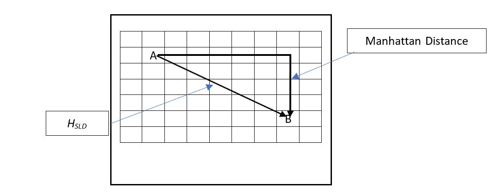

# FAQ - Technical - RMIT AI COSC1125/1127

This FAQ contains some common technical questions.

- [FAQ - Technical - RMIT AI COSC1125/1127](#faq---technical---rmit-ai-cosc11251127)
  - [Is stochastic and non-deterministic the same?](#is-stochastic-and-non-deterministic-the-same)
  - [Are HSLD and Manhattan distance same?](#are-hsld-and-manhattan-distance-same)
  - [In terms of evaluation function `f(n)`, is A\* search combination of uniform-cost search and greedy best-first search?](#in-terms-of-evaluation-function-fn-is-a-search-combination-of-uniform-cost-search-and-greedy-best-first-search)
  - [Are uniform-cost search and best-first search the same?](#are-uniform-cost-search-and-best-first-search-the-same)

## Is stochastic and non-deterministic the same?

Not quite. Both refer to the issue of an action having not just one effect, but one out of a few possible effects. The usual example is rolling a dice: there are many possible effects, and one will ensue. 

This could happen because nature is inherently non-deterministic (quantum? Check post [Is the universe fundamentally deterministic?](https://physics.stackexchange.com/questions/63811/is-the-universe-fundamentally-deterministic) if interested...) or most probably because you have _incomplete_ information (about the exact effects of the action), you don't know all the details and mechanics to craft ``the'' effect.

So the question is at what level one _models_ that phenomenon (of nature or uncertainty). If you attach a ``weight", a probability, to each possible effect that could ensue, then you are building a _stochastic model_. MDP and RL (we'll see them later) are those type of models, where every possible transition between states is annotated with a probability of that effect happening.

On the other hand, if one just wants to state what could happen but not say anything about their relative weight, then you are doing a _non-deterministic model_. This is the case of Fully-Observable Non-deterministic Planning, for example. That's all, it's about _modeling_.

It is important to observe that a non-deterministic model does _not_ mean that every option has the same probability. No! It means you just don't know the exact probabilities. Basically, you just know that the probability of each effect is greater than 0, but nothing else...

##  Are HSLD and Manhattan distance same?

No. HSLD is the straight-line distance heuristic. Straight-line distance is the distance that we measure with a ruler on a paper map by aligning two points, say from A to B.

And Manhattan distance is the distance between two points in a grid based on a strictly horizontal and/or vertical path (that is, along the grid lines). It is the sum of the horizontal and vertical blocks.

In this Figure, Manhattan distance is 10, However, determining HSLD requires more calculations.

## In terms of evaluation function `f(n)`, is A* search combination of uniform-cost search and greedy best-first search?

In some (conceptual) sense, _yes_!

In A* search, the evaluation function is $f(n) = g(n) + h(n)$, where, $f(n)$ is the path cost from the initial state to the search node `n`, and `h(n)` is the _estimated_ cost of the shortest path from n to a goal state. So, `f(n)` is the estimated cost of the best path that "continues" from `n` to a goal state.

Greedy best-first search expands first the node with the lowest `h(n)` value (the node that appears to be closest to the goal). So, the evaluation function `f(n) = h(n)`.

In uniform cost search, evaluation function is the cost of the path from the initial to the current search node `n`. So, evaluation function is `f(n) = g(n)`.

## Are uniform-cost search and best-first search the same?

Dijkstra’s algorithm or Uniform-cost search is Best-first search when the evaluation function is the cost of the path from the root to the current node. So, UCS is one of the many possible instantiations of best-first search.
